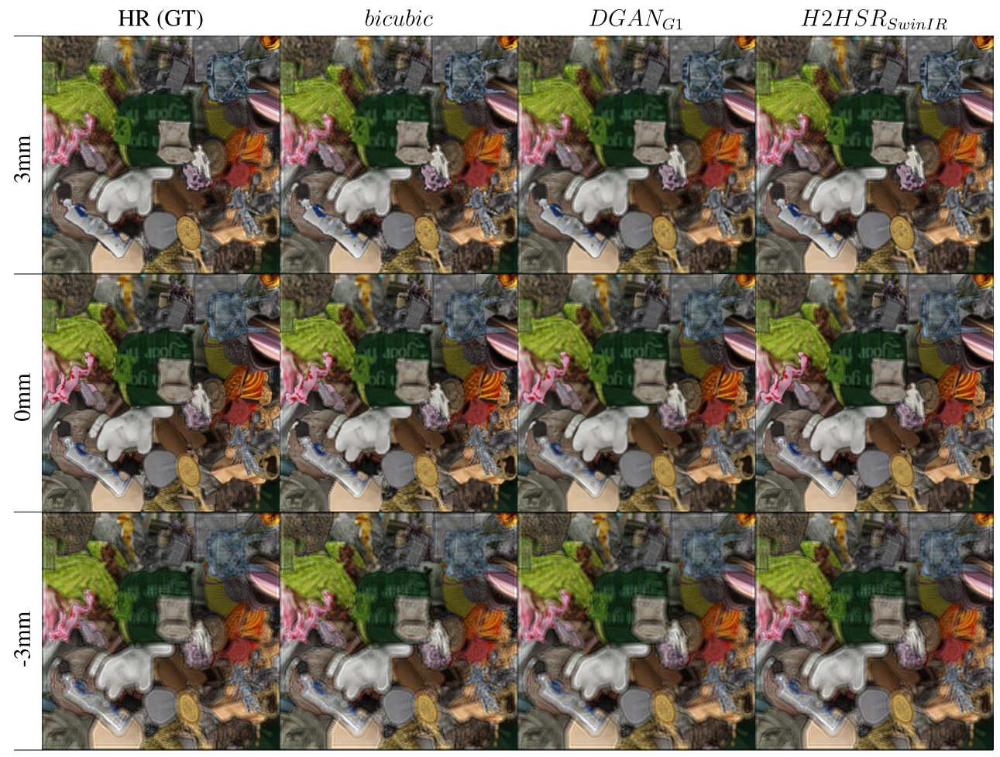

# H2HSR: Hologram-to-Hologram Super-Resolution With Deep Neural Network

[]()
[]()
[](https://creativecommons.org/licenses/by-nc/4.0/)


Official Pytorch implementation of the following paper:  
> **H2HSR: Hologram-to-Hologram Super-Resolution With Deep Neural Network**  
> Youchan No, Jaehong Lee, Hanju Yeon (ETRI), Sungmin Kwon, and Duksu Kim 
> [https://ieeexplore.ieee.org/document/10577761](https://ieeexplore.ieee.org/document/10577761)
>
> **Abstract:** In holography, the resolution of the hologram significantly impacts both display size and angle-of-view, yet achieving high-resolution holograms presents formidable challenges, whether in capturing real-world holograms or in the computational demands of Computer-Generated Holography. To overcome this challenge, we introduce an innovative Hologram-to-Hologram Super-Resolution network (H2HSR) powered by deep learning. Our encoder-decoder architecture, featuring a novel up-sampling block in the decoder, is adaptable to diverse backbone networks. Employing two critical loss functions, data fidelity and perceptual loss, we guide H2HSR to attain pixel-wise accuracy and perceptual quality. Rigorous evaluations, using the MIT-CGH-4K dataset, demonstrate H2HSR’s consistent superiority over conventional interpolation methods and a prior GAN-based approach. Particularly, in conjunction with the SwinIR encoder, H2HSR achieves a remarkable 8.46% PSNR enhancement and a 9.30% SSIM increase compared to the previous GAN-based method. Also, we found that our H2HSR shows more stable reconstruction quality across varying focal distances. These results demonstrate the robustness and effectiveness of our H2HSR in the context of hologram super-resolution.
---

## Table of Contents

- [Introduction](#introduction)
- [Installation](#installation)
- [Dataset](#dataset)
- [Train & Test](#train--test)
- [Result](#result)
- [License](#license)
- [Citation](#citation)
- [Acknowledgements](#acknowledgements)

---

## Introduction

This repository contains the official implementation of the paper
"H2HSR: Hologram-to-Hologram Super-Resolution With Deep Neural Network."
We propose a deep learning framework for generating super-resolved holograms from low-resolution holograms.
We would like to thank the Tensor Holography team for providing the MIT-CGH-4K dataset.

---

## Installation

Recommand the linux configuration such as Ubuntu to use multiple GPUs.

```bash
git clone https://github.com/HPC-Lab-KOREATECH/H2HSR.git
cd H2HSR
pip install -r requirements.txt
```

--- 

## Dataset
We use the MIT-CGH-4K dataset provided by the [Tensor Holography](https://github.com/liangs111/tensor_holography) team.  
You can download it from the [official repository](https://github.com/liangs111/tensor_holography).

```
datasets/
└── MIT-CGH-4K/
    ├── {192, 384}/
    │   ├── amplitude/{train, valid, test}/
    │   ├── phase/{train, valid, test}/
    │   └── depth/{train, valid, test}/  # (384 only)
```

---

## Train & Test

- **Training:**  
  Training scripts are located in `scripts/train/`.
- **Testing:**  
  Testing scripts are located in `scripts/test/`.
- **Pretrained Models:**  
  Trained model checkpoints can be downloaded from this [Hugging Face repository](https://huggingface.co/KimVolt/H2HSR).

**Notice:**  
The loss function used in training is based on the Tensor Holography implementation, which is not publicly available here due to licensing constraints.  
To train this model, please use an alternative loss function or implement a compatible one yourself.


---

## Result
Here is an example of reconstruction results after super-resolution.



*Reconstruction results (from left to right):*  
(1) High-resolution (Ground-truth)  
(2) Bicubic interpolation  
(3) [Dual-generator GAN (DGAN)](https://ieeexplore.ieee.org/document/9897411)  
(4) H2HSR

---

## License

© 2025, HPC Lab, Korea University of Technology and Education (KOREATECH)  
and Digital Holography Research Group, Electronics and Telecommunications Research Institute (ETRI)  
All rights reserved.

This project is licensed under the **Creative Commons Attribution-NonCommercial 4.0 International (CC BY-NC 4.0)** license.  
You are free to use, modify, and distribute this work **for non-commercial research and educational purposes**, with proper attribution.  
**Commercial use is strictly prohibited.**

See [LICENSE](./license.txt) and the [official CC BY-NC 4.0 license](https://creativecommons.org/licenses/by-nc/4.0/) for full terms.

For inquiries, please contact the corresponding author: **bluekdct@gmail.com**

---

## Citation

If you use this code, please cite the following paper:

```bibtex
@article{no2024h2hsr,
  title={H2HSR: Hologram-to-Hologram Super-Resolution With Deep Neural Network},
  author={No, YouChan and Lee, Jaehong and Yeom, Hanju and Kwon, SungMin and Kim, Duksu},
  journal={IEEE Access},
  year={2024},
  publisher={IEEE}
}
```

---

## Acknowledgements

This work is based in part on the Tensor Holography project, and we gratefully acknowledge the Tensor Holography team for providing the MIT-CGH-4K dataset.

We would also like to thank the Digital Holography Research Group at the Electronics and Telecommunications Research Institute (ETRI) for their valuable support and contributions.

This work was supported in part by the National Research Foundation of Korea (NRF) through the Ministry of Education as part of the Basic Science Research Program, “High-Performance CGH Algorithms for Ultra-High Resolution Hologram Generation” (40%, Grant No. 2021R1I1A3048263); in part by the “Regional Innovation Strategy (RIS)” (10%, Grant No. 2021RIS-004); and in part by the Institute of Information and Communications Technology Planning and Evaluation (IITP) grant funded by the Korean Government [Ministry of Science and ICT (MSIT)], “Development of Holo-TV Core Technologies for Hologram Media Services” (50%, Grant No. 2019-0-00001).

We thank all contributors and collaborators for their support.

---
